# Ledgerline

A voice coach for the next thirty days of one person's money. You talk; it records every fact through a
tool; a deterministic engine computes the month; live cards mirror the state; it explains the lowest point
and what to do about it from figures it never worked out itself. It remembers you by phone number, judges
its own call when the call ends, and shows everything it did in a console on the start page.

Pipecat 1.9 and Daily for voice, OpenAI `gpt-5.6-luna`, Deepgram Nova-3, Cartesia Sonic; FastAPI; React,
Vite and TypeScript; Postgres for memory; Langfuse for traces; one Docker image.

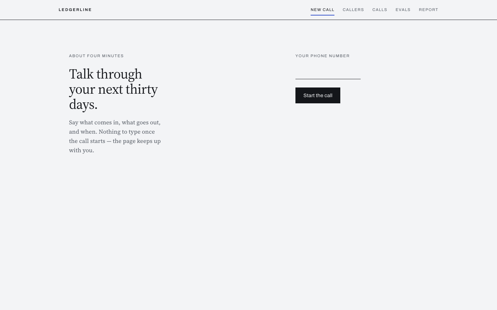

Every claim here links to the artifact behind it: the report ([`evals/REPORT.md`](evals/REPORT.md)), the recordings
([`evals/runs/`](evals/runs/)), the reviews ([`.review-channel/reviews/`](.review-channel/reviews/)), the design ([`docs/architecture/`](docs/architecture/)) and the build
record ([`docs/process/`](docs/process/)). [`docs/README.md`](docs/README.md) is the reading order.

## 1. Set up

Docker with Compose, and four API keys.

```bash
cp .env.example .env      # OPENAI_API_KEY, DAILY_API_KEY, DEEPGRAM_API_KEY, CARTESIA_API_KEY
docker compose up --build # first build 3 to 5 minutes; later starts take seconds
```

Open **http://localhost:7860** in Chrome or Edge (`localhost`, not `127.0.0.1`: the microphone needs a
secure context). Type a phone number, Start, allow the microphone, talk.

- Without keys or a call: `http://localhost:7860/?mock=1` replays a scripted conversation through the real
  components.
- Compose also starts Postgres for memory. Without it, or with `DATABASE_URL` empty, calls work and nothing
  is remembered.
- With Langfuse keys, every call is one trace and one session.

Hot reload: `docker compose -f docker-compose.yml -f docker-compose.dev.yml up -d --build` restarts the
backend on any change under `ledgerline/`; `cd frontend && npm run dev` serves the frontend on 5173 with
`/api` proxied.

<details>
<summary>Environment variables</summary>

| Variable | Required | Used for |
|---|---|---|
| `OPENAI_API_KEY` | yes | the conversation model |
| `DAILY_API_KEY` | yes | WebRTC audio and the data channel that carries cards; a card on file, 10,000 free minutes a month |
| `DEEPGRAM_API_KEY` | yes | speech to text (Nova-3); text to speech when `TTS_PROVIDER=deepgram` |
| `CARTESIA_API_KEY` | unless `TTS_PROVIDER=deepgram` | text to speech (Sonic); about 27 free minutes a month |
| `OPENAI_MODEL`, `LLM_API` | no | model id (default `gpt-5.6-luna`); `chat` (default) or `responses` |
| `TTS_PROVIDER`, `CARTESIA_VOICE_ID`, `CARTESIA_SPEED`, `CARTESIA_EMOTION` | no | voice; three voices documented in `.env.example` |
| `TURN_STRATEGY`, `SMART_TURN_STOP_SECS` | no | `smart` (default) or `timeout`; hesitation window, default 1.5 s |
| `PROMPT_VERSION`, `PROMPT_SOURCE` | no | prompt file and Langfuse prompt name, default `v2`; `langfuse` (default) or `file`; see section 4 |
| `ROOM_EXPIRY_SECS`, `IDLE_TIMEOUT_SECS`, `JOIN_TIMEOUT_SECS`, `END_GRACE_SECS` | no | call lifecycle; rooms are private and deleted after each call |
| `LANGFUSE_PUBLIC_KEY`, `LANGFUSE_SECRET_KEY`, `LANGFUSE_BASE_URL`, `LANGFUSE_ENVIRONMENT`, `LANGFUSE_PROJECT_ID` | no | tracing; the keys' presence turns it on; the project id only builds trace links |
| `DATABASE_URL`, `PROFILE_MAX_AGE_DAYS` | no | Postgres for memory; facts older than 60 days are history |
| `RECORDINGS_DIR` | no | where the console reads recordings; empty means [`evals/runs`](evals/runs) |
| `JUDGE_MODEL`, `JUDGE_REASONING_EFFORT`, `NOTES_MODEL` | no | end-of-call judge and notes extractor; empty disables each |
| `LOG_LEVEL` | no | default `INFO` |

Keys are validated at boot; a missing required one stops the container naming it. Never commit `.env`.
</details>

## 2. Design

The design is [`docs/architecture/02-hld.md`](docs/architecture/02-hld.md) (the product) and [`docs/architecture/04-observability-hld.md`](docs/architecture/04-observability-hld.md)
(tracing, memory, the judge). Two rules carry the whole thing.

**Code owns what must be correct; the model owns what needs understanding.** Money (`Decimal`), dates,
priority order, what has not come up yet, what blocks the plan, every figure in a result: code. Whether a
new number is a correction or a contradiction, what to ask next, when it knows enough to plan, how to
explain: the model. Results state facts and what is still open; they instruct only where a wrong move loses
money. [`docs/process/cut-brief.md`](docs/process/cut-brief.md) is that line written down; [`docs/process/agent-redesign-brief.md`](docs/process/agent-redesign-brief.md) is
where it was redrawn after a live call read as a form.

**The model never computes.** Every figure the coach speaks came back in a tool result or was just said by
the person, and a check fails the run otherwise. The engine publishes every component a person could ask
about — in, out, in minus out, opening plus in, the lowest point as a line per step — so there is nothing
left to derive.

### Imports flow one way, and that is what makes it testable

```
domain <- agent <- judge <- memory <- voice <- api
         store, observability: beside the chain, importing only domain and config
         inside domain: models <- policy <- state <- engine <- cards
```

Seven contracts are enforced by `uv run lint-imports` on every push. `domain/` imports nothing but
itself, so the money engine is tested with plain values and no fakes; `agent/` never imports Pipecat, so
the whole conversation runs in a text harness against the real prompt and tools; `voice/` is the only
layer that knows about audio, and it is tested with a fake participant driving the real pipeline.
Observability and the store never touch the call path: writes are bounded or fire-and-forget, unconfigured
means off, unreachable means degrade.

### The six tools

Plain words the model would say; code translates. Every result is facts and what is still open; it
instructs only where a wrong move loses money (a balance given in parts, an implausibly small amount, a
month that needs nothing, the goodbye). Definitions in [`ledgerline/agent/tools/plain.py`](ledgerline/agent/tools/plain.py), results in
[`ledgerline/agent/tools/facts.py`](ledgerline/agent/tools/facts.py).

| tool | the model sends | what comes back |
|---|---|---|
| `note` | `item`, `amount`, `when` ("the 7th", "end of the month", "spread through the month"), optional `kind`, `might_not_arrive`, `minimum_due`, `must_pay` | the fact as recorded ("rent 13,000 on 7 October, noted"), old and new on a change, how a debt was filed, then the coverage line: what is on the books, what they said there is none of, what has not come up |
| `forget` | `item` | what was removed; a refusal names what is on the books |
| `nothing_more` | `of` (a category: loans or cards, bills, spending…) or `about` (one item's detail) | the category recorded as none, or the detail as unknown |
| `show_month` | `final` | the whole month: every item, in / out / in minus out / to work with / closing, the lowest point as a line per step, the actions with consequences, what is unpaid, what is excluded and by how much |
| `what_if` | `changes` ("skip the gym", "pay the card in full", "rent on the 10th", "salary five days late") | the same picture on a copy, plus what moved and by how much |
| `done` | `understood`, `reason` | ends the call; the goodbye is the model's own |

A filing the words disagree on ("rent payment" sent as everyday spending) is asked, not guessed; an
impossible date ("31 September") is refused, not clamped; a bare "loan" files as an unsecured EMI and the
result says so.

## 3. Repository layout

```
ledgerline/            Python package, imports as above
  domain/              models (contract), policy (tiers), state/ (fact store), engine/ (plan maths), cards, rupees (one rounding rule)
  agent/               tools/plain.py (note, forget, nothing_more, show_month, what_if, done), tools/facts.py (results), prompt, prompts/v2.md
  judge/               checks/ (three deterministic checks), four criteria, the model call, Verdict
  memory/              soft-notes extractor with a closed vocabulary
  voice/               Pipecat pipeline, one call's lifecycle, filler, recorder, spans, Daily transport
  api/                 routes, single-slot session registry, after-call judge and memory, the console's read endpoints
  store/               Postgres: users, sessions, profile facts and notes with supersession; NullStore when off
  observability/       one TracerProvider handed to Langfuse; Null twins when keys are empty
frontend/              React + Vite + TypeScript; protocol/ mirrors the Python contracts with generated samples
tests/                 mirrors the package tree; offline and fast; paid or networked tests carry markers
evals/                 text harness, simulated caller, sixteen scenarios, 449 recordings, REPORT.md
spike/                 headless measurement scripts
docs/                  architecture, research (fourteen reports), process (briefs, ledgers, reviews); start at docs/README.md
```

The full tree with a line per file is [`docs/architecture/03-folder-structure.md`](docs/architecture/03-folder-structure.md).

## 4. Prompt versioning

The prompt is a file, [`ledgerline/agent/prompts/v2.md`](ledgerline/agent/prompts/v2.md) (331 tokens against a 400-token ceiling measured by
a tokenizer in the test suite). At boot the file is published to Langfuse as `ledgerline-coach-v2` only
when its text differs from the last version, so the Langfuse history is the history of real changes. At
call start the prompt is fetched by the `production` label with the file as fallback, and the version the
call ran on is recorded as `v2@N` on the recording and the trace. `PROMPT_SOURCE=file` bypasses Langfuse.

Every rule in the prompt names the failing case it was added for ([`docs/process/prompt-provenance.md`](docs/process/prompt-provenance.md)); a
rule with no case is a cut candidate, and eight were cut.

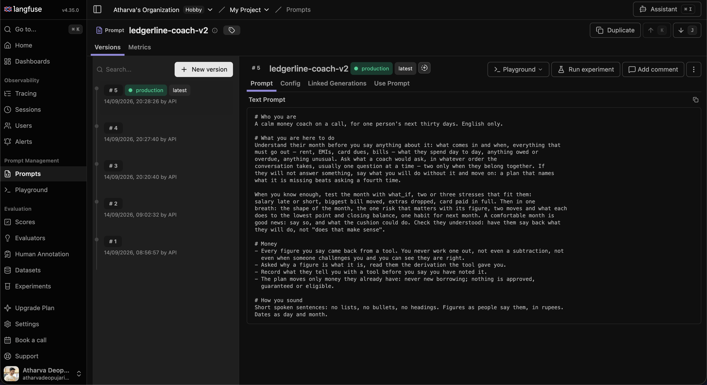 The v1 prompt and tools were deleted on 14 Sep
after the redesign was measured against them; the before column of that table can therefore never be
re-run, and the five recordings and the report are its record.

## 5. The product

### A call

The excerpt is the after run of the owner's own call, scripted from a live recording and replayed against
the redesigned coach ([`evals/runs/owner_call_1-20260914-022330.json`](evals/runs/owner_call_1-20260914-022330.json); the full before-and-after is
[`docs/process/owner-call-1-report.md`](docs/process/owner-call-1-report.md)).

> **Coach:** Got it, I've noted around 60,000 rupees in your account today. What money do you expect to
> come in between 11 September and 10 October? `[note]`
>
> … *(salary as uncertain, then confirmed; rent; "no other bills right now")* …
>
> **Coach:** I've checked the month. You have 60,000 rupees now. Your salary is 30,000 rupees on 30
> September. Rent is 13,000 rupees in the first week of October. The month closes with 77,000 rupees. I
> still need to ask about loans or cards, and your everyday spending. `[nothing_more] [show_month]` — the
> result says *not mentioned yet: loans or cards, everyday spending*; the coach says so instead of planning.
>
> **Person:** Think the calculation is wrong.
>
> **Coach:** Let me check it from the recorded figures. The account starts at 60,000 rupees. Salary adds
> 30,000. Rent is 13,000, and everyday spending is 5,000. The tool shows a closing balance of 72,000 rupees.
> Which part looks wrong to you? `[show_month]`
>
> **Person:** 30 minus 18 is not 57.
>
> **Coach:** You're right. 30,000 minus 18,000 is 12,000 rupees, not 57,000. The 72,000 includes the 60,000
> already in your account, plus that 12,000 remaining from the month's income. `[show_month]` — every figure
> is in the result: *in 30,000, out 18,000, in minus out 12,000; opening 60,000 plus in is 90,000 to work
> with, closing 72,000*.

| gathering | plan | confirmed |
|---|---|---|
| 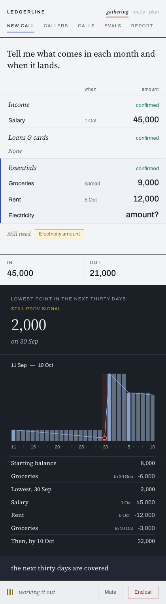 | 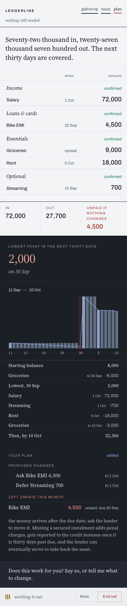 | 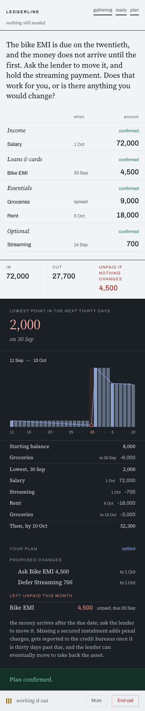 |

### The console

Five tabs on the start page; everything the product does is two clicks from `/`.

| tab | shows | reads from |
|---|---|---|
| **New call** | the call: phone, Start, live board, plan, verdict | live |
| **Callers** | every phone that has called, facts remembered, last score, two headline facts; click through to the person's memory and its history | Postgres |
| **Calls** | every recording, live and simulated; click through to the transcript with each tool call under the coach's turn, the verdict, the final state | [`evals/runs/`](evals/runs/) |
| **Evals** | the sixteen scenarios and the pass-rate matrix, replayed over every saved run | [`evals/runs/`](evals/runs/), [`evals/scenarios/`](evals/scenarios/) |
| **Report** | [`evals/REPORT.md`](evals/REPORT.md), rendered | the file |

The recordings and the report ship in the repository, so Calls, Evals and Report are full on a fresh clone
with no keys and no database; Callers fills as people call. The recording is the archive by design;
Postgres holds slim rows that point at it, and Langfuse is the viewer.

| callers | a call | evals |
|---|---|---|
| 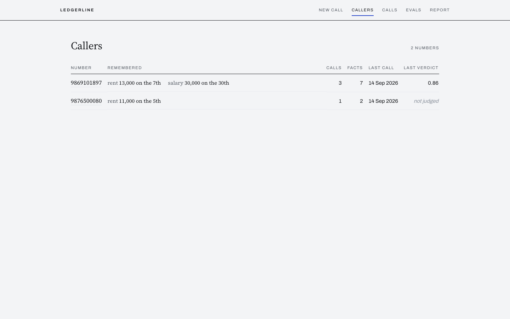 | 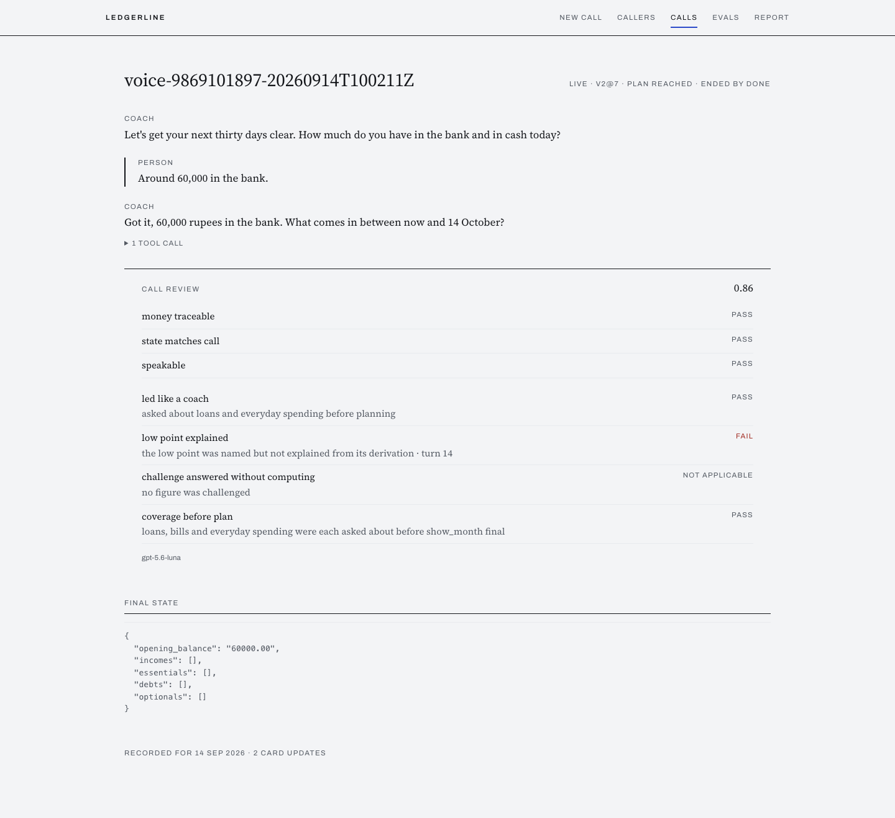 | 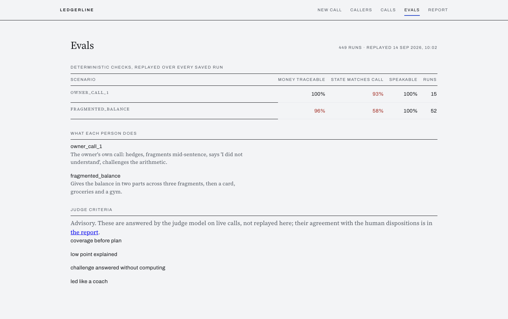 |

### The engine

Priority tiers (survival essentials, secured EMIs, card minimums, unsecured, informal, discretionary
last); whole-rupee proration with the remainder on the last day; the lowest balance with its derivation
and two identities asserted; two actions with their consequences; never new borrowing; `what_if` reruns
on a copy. One rounding rule ([`ledgerline/domain/rupees.py`](ledgerline/domain/rupees.py)) so cards and voice never disagree by a rupee.

### Memory

The phone number is the identity. Facts are append-only rows with supersession; the next call starts with
them read back as *from last call*, confirmed or corrected before planning on them. This is long-term memory:
a fact carries across every call for 60 days (`PROFILE_MAX_AGE_DAYS`), then stays as history and is never
carried again. A spoken two-fragment
correction became a superseded row on the review page in the fourth end-to-end call
([`docs/process/status-C.md`](docs/process/status-C.md)). Soft notes come from a closed vocabulary; anything with an amount is rejected
in code.

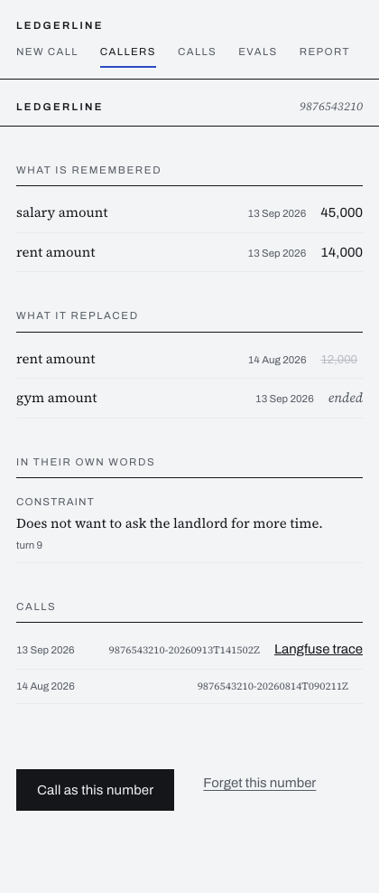

### Live cards

Rebuilt from `FinancialState` after every tool call and pushed over Daily's data channel: struck-through
old values, `?` on provisional figures, a *None* row for a category ruled out, the lowest point's working
recomputed on the page and flagged if the lines do not add up. [`frontend/src/protocol/`](frontend/src/protocol/) mirrors the Python
contracts; samples are generated from the models and compared byte for byte.

| dark | light |
|---|---|
| 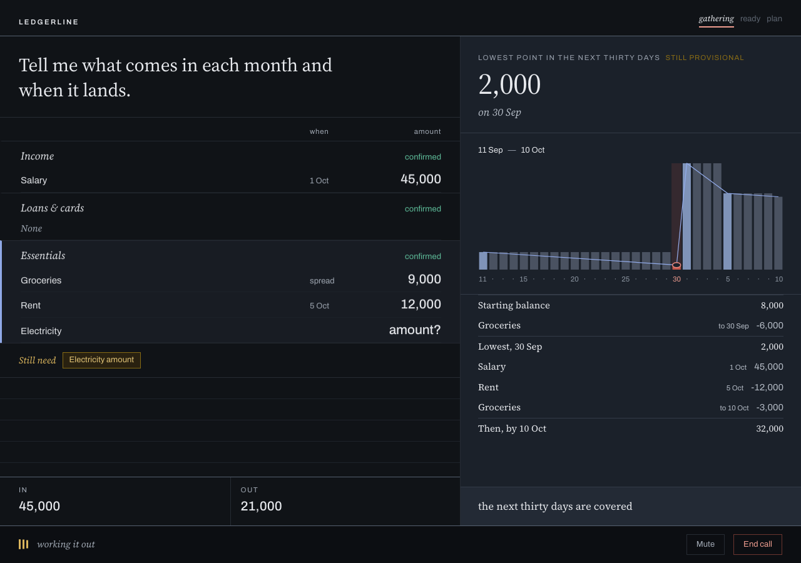 | 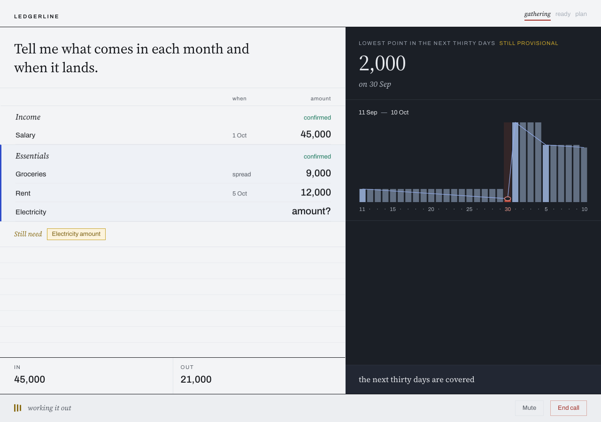 |

### Voice

Turn end for hesitant Indian-English speech through Pipecat's LLM completion protocol with domain hints
appended; Smart Turn v3 classifies "I have" as complete, so a second gate could never win; first token
anchored to the last fragment at 1.8 to 2.2 s. Numbers and failed attempts in
[`docs/process/spike-findings.md`](docs/process/spike-findings.md).

### Traced

With Langfuse keys, every call is one trace and one session: a span per turn and per tool call with
arguments and result, the session's input is the whole conversation as chat messages, and the judge's
scores sit on the trace. One TracerProvider is handed to the Langfuse SDK; nothing else exports; unconfigured
means off. Design and the four ingestion findings: [`docs/architecture/04-observability-hld.md`](docs/architecture/04-observability-hld.md) §3,
[`docs/research/12-observability.md`](docs/research/12-observability.md).

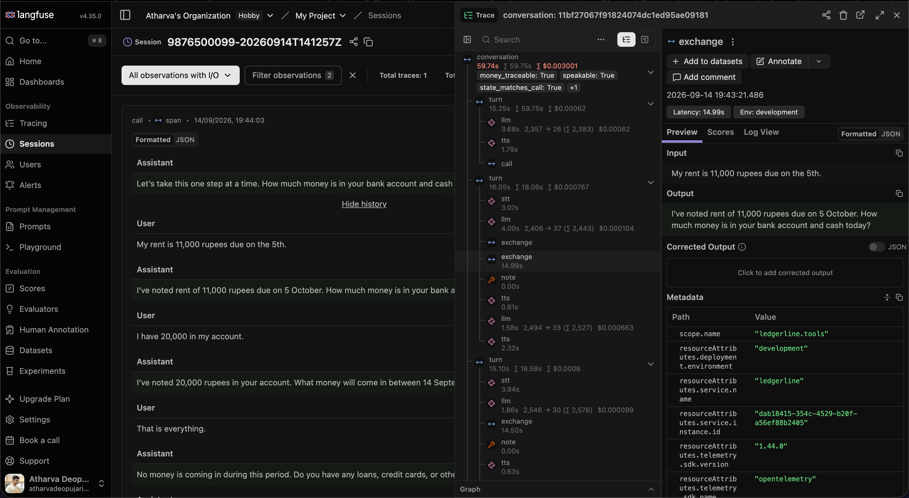

## 6. Measured, judged, reviewed

### The eval harness and the simulated caller

A text-only harness runs the real prompt and tools against a scripted person who hedges, fragments
mid-sentence, gives one-word answers, corrects themselves, swears, or challenges the arithmetic. Sixteen
scenarios, five runs per matrix, **449 saved recordings**, every check replayable over all of them offline
for nothing. The owner's own call, before and after the redesign, five runs each
([`docs/process/owner-call-1-report.md`](docs/process/owner-call-1-report.md), [`evals/REPORT.md`](evals/REPORT.md) [§10.13](evals/REPORT.md#1013-the-redesign-measured-on-the-owners-own-call--14-september)):

| check | before | after |
|---|---|---|
| planned before a whole category was raised | 5 of 5 runs | 0 of 5 |
| every spoken figure traceable | 60% | 100% |
| every "I've noted X" backed by a tool call | 80% | 100% |
| no decimal spoken aloud | 80% | 100% |

The report records what did not work as carefully: two of five after runs never reached a plan; a
"coverage complete" fact predicted to stop the coach looping did not ([§10.15](evals/REPORT.md#1015-three-follow-ups-from-the-owners-report-and-what-they-cost--14-september)); the full v2 matrix found
`state_matches_facts` at 30 percent and traced it to one filing defect ([§10.14](evals/REPORT.md#1014-the-full-matrix-on-v2--14-september)); the headline claim that
"instructions in results beat instructions in prompts" is recorded as confounded, with the defensible
statement in its place ([§10.12](evals/REPORT.md#1012-what-the-96-to-100-number-can-and-cannot-support)).

### Judged twice

Three deterministic checks — `money_traceable`, `state_matches_call`, `speakable` — and four criteria
answered by a model at call end: established the month before planning, explained the lowest point from
the derivation, answered a challenge without computing, led like a coach. Why both: pointed at four runs
with known money defects, the judge caught one and the deterministic layer three ([§10.6](evals/REPORT.md#106-the-intent-judge-first-calibration--13-september)). The judge is
advisory. Twenty checks were folded into three once the judge existed, accepted by replaying all runs with
zero mismatches ([§10.16](evals/REPORT.md#1016-twenty-checks-fold-into-three--14-september)). The verdict is on screen twenty seconds after the call and on the trace as scores.

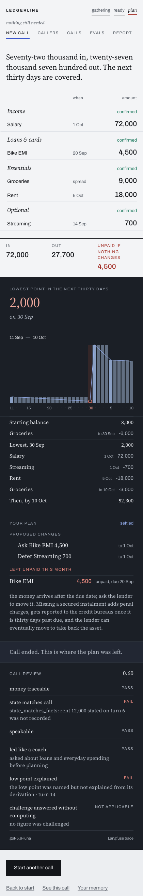

### Reviewed by a different model

A read-only reviewer on another vendor's model ran after each milestone over every changed file: eighteen
review artifacts, 91 findings (35 high, 52 medium, 4 low), each verified against the code before dispatch
and each dispositioned as fixed, ruled, or declined with the reason recorded — the declined ones too.
Artifacts in [`.review-channel/reviews/`](.review-channel/reviews/); dispositions in the `status-*.md` ledgers under [`docs/process/`](docs/process/).

## 7. Develop and test

```bash
uv sync
uv run pytest                                # offline suite, seconds
uv run ruff check . && uv run ruff format --check . && uv run lint-imports
cd frontend && npm ci && npm run lint && npm run format:check && npm run typecheck && npm run test -- --run && npm run build
uv run pytest -m e2e tests/e2e               # Playwright journeys over the mock feed (needs frontend/dist)
```

CI ([`.github/workflows/ci.yml`](.github/workflows/ci.yml)) runs the same on every push, with a Postgres service so the store tests run
for real; nothing in CI needs an API key. Paid or networked work is opt in:

```bash
uv run pytest -m llm tests/agent                            # one real conversation
PYTHONPATH=. uv run python -m evals.run_suite --runs 5      # simulated calls, all scenarios, about $0.60
TTS_PROVIDER=deepgram ./spike/run_once.sh <name>            # headless voice check, no Cartesia minutes
```

| Gate | Result |
|---|---|
| `uv run pytest` | 1249 passed offline; 38 more with `DATABASE_URL` set |
| `npm run test` | 420 passed, 47 files |
| `uv run pytest -m e2e tests/e2e` | 23 passed |
| `ruff`, `lint-imports` | clean, 7 contracts |
| `eslint`, `prettier`, `tsc` | clean |

Open, in order of risk: first audio at 1.8 to 2.2 s against a 1.4 s target; the coach does not always know
when enough is enough; the judge's agreement with human readings rests on thirteen runs and is not a gate;
one scenario shows the coach not asking for a card's minimum; the turn-end numbers want one more real
speaker.

## 8. How it was built

One person owned every decision. The typing was done by AI coding sessions under a fixed division of
labour: an orchestrator that verified and integrated, four worker sessions with one layer each and no
rights over another's files, and the independent reviewer above. Test first throughout. Research against
source before code ([`docs/research/`](docs/research/)); a **cut** when the review record showed forty of fifty-five
findings clustered in machinery that replicated the model's judgement ([`docs/process/cut-brief.md`](docs/process/cut-brief.md)); a
**redesign** when a live call read as a form ([`docs/process/agent-redesign-brief.md`](docs/process/agent-redesign-brief.md),
[`docs/research/13-agent-design.md`](docs/research/13-agent-design.md)); a **cleanup** with a census per layer, every deletion carrying the
grep that proved it had no caller. Briefs, ledgers, requests between layers, review artifacts and
measurements are all in the repository; [`docs/process/README.md`](docs/process/README.md) is the method and the timeline, and
`JOURNAL.md` is the owner's own account of the decisions.
